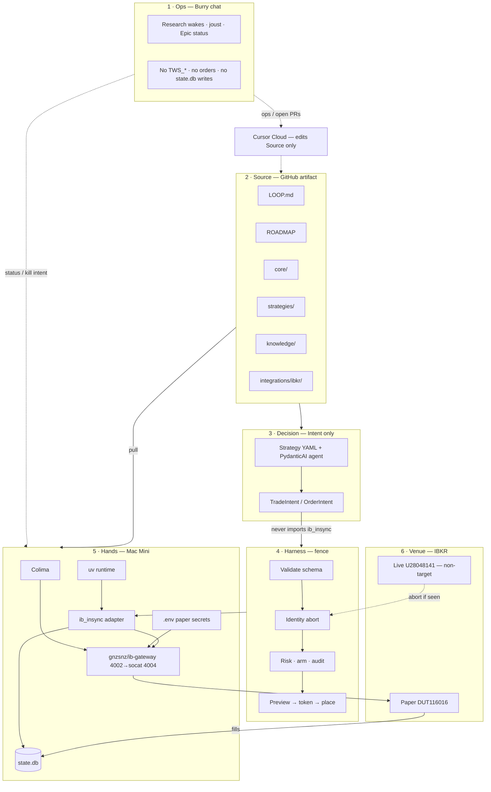

# Options-trading-bot architecture

Source of truth for planes, tools, and boundaries. Amended with Zishan 2026-09-12.

## Diagram

## Tool opinions (Zishan)

| Tool | Verdict | Notes |
|---|---|---|
| Colima + Docker | Keep | Isolates Gateway; Mini only |
| gnzsnz/ib-gateway | Keep (pin digest) | Paper 4002→4004; no live in same compose |
| ib_insync | Keep | Execution adapter only; strategies never import |
| uv | Keep | Mini toolchain + lockfile |
| SQLite state.db | Keep | Mini only |
| PydanticAI | Keep, scope-lock | Decision → intents; not harness gates |
| Strategy YAML | Keep | Cloud edits; Mini loads |

## Gaps not to draw as shipped

- strategies/active empty
- identity abort + preview-token not in code
- Epic 0 fill pending
